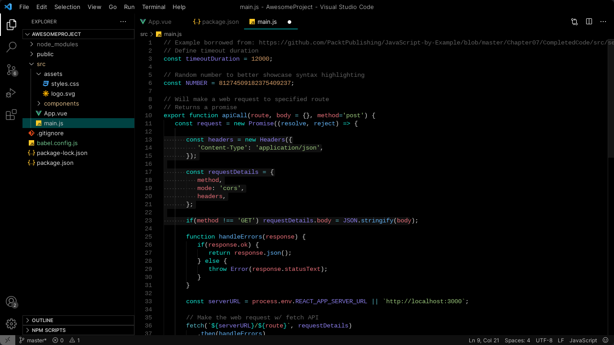
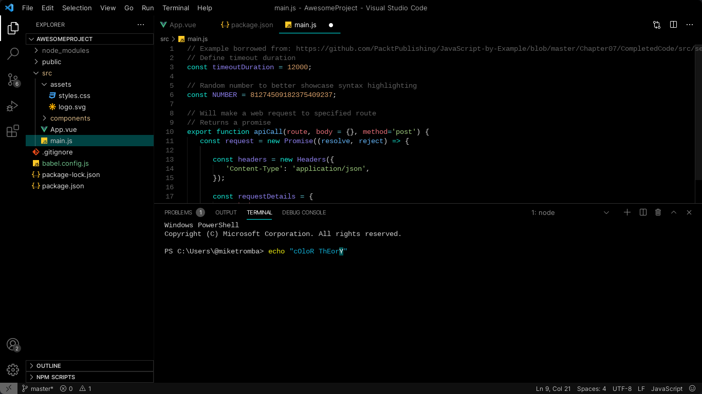
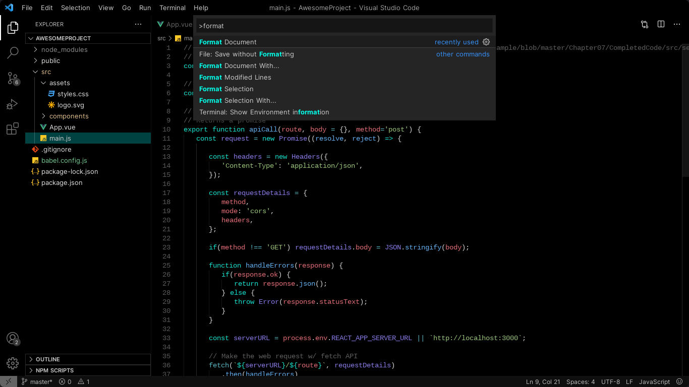

  
   
   
  <h1 align="center" >Kodemia's VS Code Official Themes</h1>

   
  <b align="center">⚫ Black Version ⚫</b>
   

  
  
  

   
  <b align="center">⚪ White Version ⚪</b>
   
  
Coming soon... or not... 

